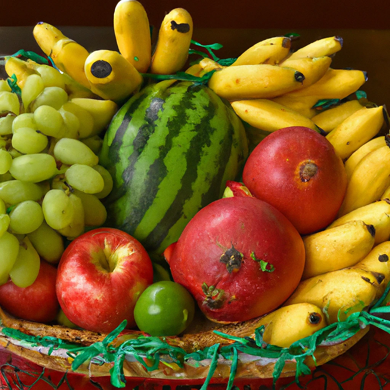

### Projeto - Preço de uma Cesta de Frutas em 2022

Base de dados utilizada: https://www.hfbrasil.org.br/br

A HFBrasil é uma das partes do Centro de Estudos Avançados em Economia Aplicada da ESALQ e disponibiliza informações sobre o setor de frutas e hortaliças. Em seu site é possível coletar informações de preços de frutas, legumes e verduras para algumas regiões do país. Neste projeto, avaliamos os preços médios mensais para uma cesta de frutas composta por:
* Banana Prata
* Uva Itália
* Melancia Graúda
* Manga Tommy
* Maçã Gala

O objetivo deste projeto é realizar uma análise do comportamento dos preços de cada uma dessas frutas no ano de 2022 e como os preços delas se comportaram no primeiro mês de 2023. Observamos qual foi a fruta com maior preço médio de 2022, quais frutas tiveram maior aumento e maior queda no período e qual fruta apresentou maior variação em seus preços em 2022. Além disso, verificamos o tamanho do impacto da inflação nos preços. Por fim, pudemos ver a tendência dos preços para cada uma das frutas no início de 2023. O Jupyter Notebook onde foi realizada a análise pode ser visto em: https://nbviewer.org/github/tharikf/Projeto_Preco_Frutas/blob/main/Avaliando_Preco_Frutas.ipynb.

PS: A imagem abaixo foi gerada com o auxílio da inteligência artificial no site DALL-E da empresa OpenAI.

  

